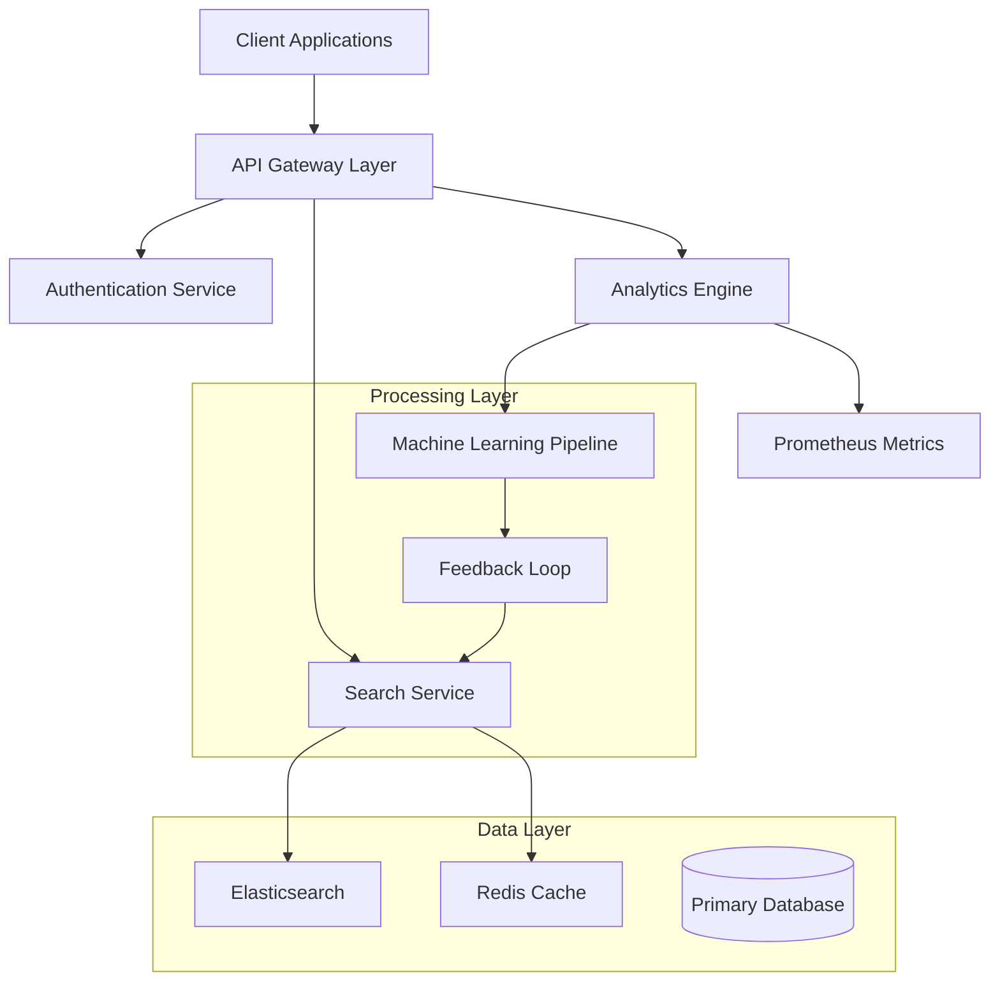
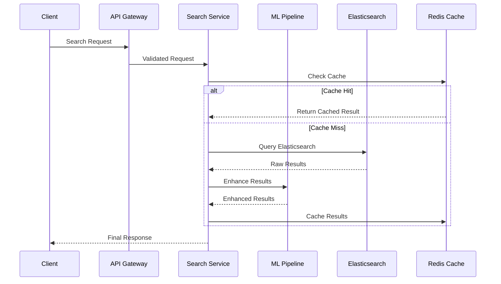
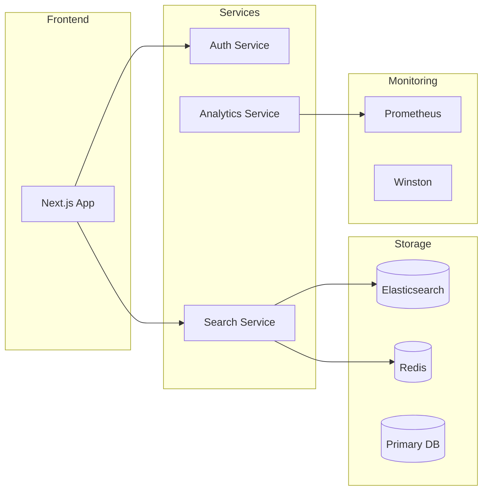
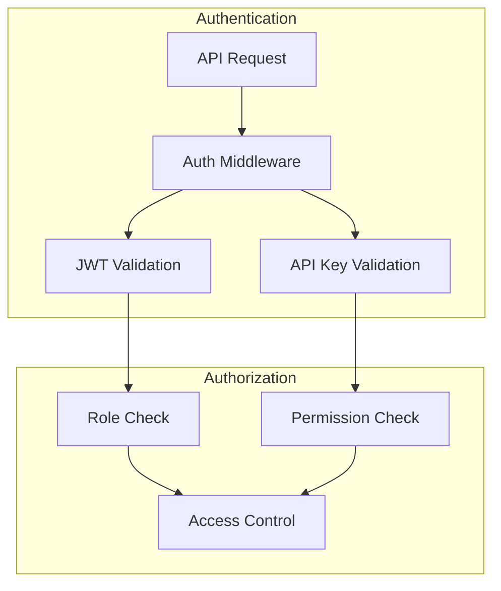

# The Sophra System

## Overview

Sophra is an open-source and enterprise-grade data synchronization and management layer created by The Sophra Organization. It leverages modern cloud architecture to provide sophisticated search capabilities and intelligent data processing. Built on Next.js 14 with TypeScript, it combines powerful search operations with machine learning capabilities to deliver adaptive, self-improving data interactions.

The system is designed with a microservices-oriented architecture, emphasizing scalability, reliability, and real-time processing capabilities. It serves as a central hub for data operations, managing everything from search queries to A/B testing while maintaining robust security protocols through JWT-based authentication, API key management, and role-based access control. The system includes comprehensive monitoring via Prometheus metrics and supports development workflows with Docker containerization.

## Architecture Overview



### Data Flow Architecture



## Features

### Advanced Search Operations

The search infrastructure is built on Elasticsearch 8.x, providing:

- Vector embedding support for semantic search
- Multi-index search capabilities
- Real-time indexing and updates
- Custom scoring and boosting

### Adaptive Learning System

The platform implements a sophisticated learning pipeline that:

- Analyzes search patterns and user interactions
- Adjusts relevance scoring in real-time
- Provides automated optimization suggestions
- Maintains feedback loops for continuous improvement

### A/B Testing Framework

Built-in experimentation capabilities include:

- Multiple concurrent test management
- Automatic traffic allocation
- Statistical significance calculations
- Real-time performance monitoring

## Technical Implementation and Framework

### System Architecture



### Core Technologies

- **Framework**: Next.js 14 with TypeScript for type-safe development
- **Database**: Prisma ORM with support for multiple database backends
- **Search**: Elasticsearch 8.x for advanced search capabilities
- **Caching**: Redis for high-performance data caching
- **Monitoring**: Prometheus and Winston for comprehensive system observability
- **AI Integration**: OpenAI API for advanced text processing
- **Authentication**: Dual system with JWT and API keys

## Getting Started

### Prerequisites

- Node.js 18+
- PNPM package manager
- Docker (for local development)
- Elasticsearch 8.x
- Redis 6+

### Installation Manual

1. **Clone and Install Dependencies**

```bash
git clone https://github.com/your-org/sophra.git
cd sophra
pnpm install
```

2. **Environment Configuration**
   Create a `.env` file with the following:

```env
POSTGRESQL_URL="your-database-url"
ELASTICSEARCH_URL="your-elasticsearch-url"
ELASTICSEARCH_API_KEY="your-elasticsearch-api-key"
SOPHRA_REDIS_URL="your-redis-url"
OPENAI_API_KEY="your-openai-key"
```

3. **Development Server**

```bash
pnpm dev
```

## Security Implementation



The system implements a comprehensive security model with:

- JWT-based authentication for user sessions
- API key authentication for service-to-service communication
- Role-based access control
- Rate limiting and request validation
- Automatic token rotation
- Security audit logging

## Monitoring & Analytics

The monitoring infrastructure provides:

- Real-time system metrics via Prometheus
- Custom business metrics for search operations
- A/B testing performance tracking
- User behavior analytics
- System health monitoring
- Performance optimization insights

## Development Workflow

### Available Scripts

```bash
pnpm dev          # Start development server
pnpm build        # Build for production
pnpm start        # Start production server
pnpm lint         # Run linting
pnpm type-check   # Run type checking
pnpm tokenseed    # Seed authentication tokens
```

### Project Architecture

```
sophra/
├── src/
│   ├── app/          # Next.js application code
│   ├── lib/          # Shared utilities
│   ├── services/     # Core services
│   └── types/        # TypeScript definitions
├── prisma/           # Database schema and migrations
├── postman/          # API documentation
└── docs/            # Additional documentation
```

Created with care by The Sophra Organization. Data intelligence for the people.
