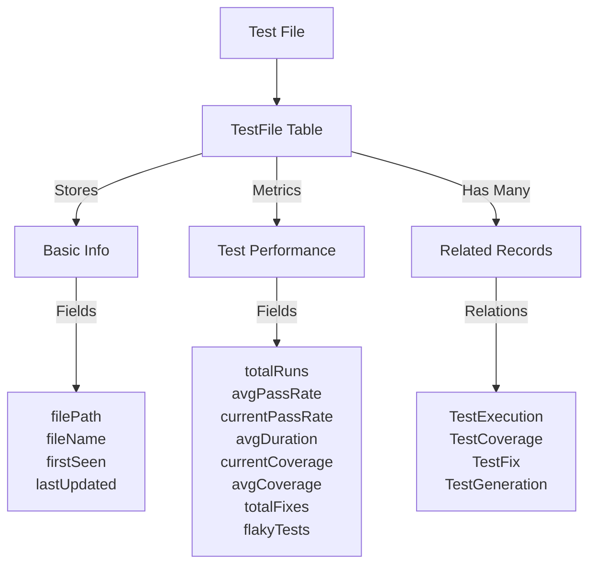
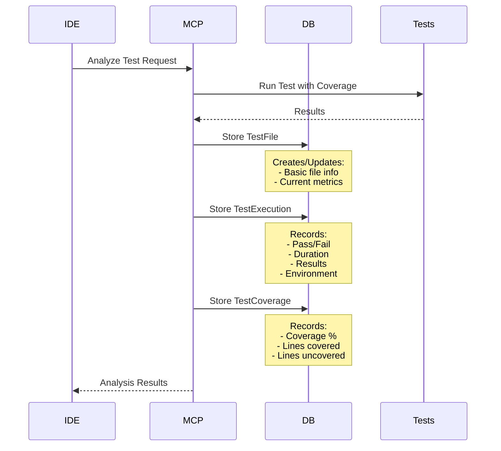

```mermaid
graph TB
    A[Test File] --> B[TestFile Table]
    B --> |Stores| C[Basic Info]
    B --> |Metrics| D[Test Performance]
    B --> |Has Many| E[Related Records]
    
    C --> |Fields| C1[filePath<br/>fileName<br/>firstSeen<br/>lastUpdated]
    D --> |Fields| D1[totalRuns<br/>avgPassRate<br/>currentPassRate<br/>avgDuration<br/>currentCoverage<br/>avgCoverage<br/>totalFixes<br/>flakyTests]
    E --> |Relations| E1[TestExecution<br/>TestCoverage<br/>TestFix<br/>TestGeneration]
```

```mermaid
sequenceDiagram
    participant IDE
    participant MCP
    participant DB
    participant Tests

    IDE->>MCP: Analyze Test Request
    MCP->>Tests: Run Test with Coverage
    Tests-->>MCP: Results
    
    MCP->>DB: Store TestFile
    Note over DB: Creates/Updates:<br/>- Basic file info<br/>- Current metrics
    
    MCP->>DB: Store TestExecution
    Note over DB: Records:<br/>- Pass/Fail<br/>- Duration<br/>- Results<br/>- Environment
    
    MCP->>DB: Store TestCoverage
    Note over DB: Records:<br/>- Coverage %<br/>- Lines covered<br/>- Lines uncovered
    
    MCP-->>IDE: Analysis Results
```